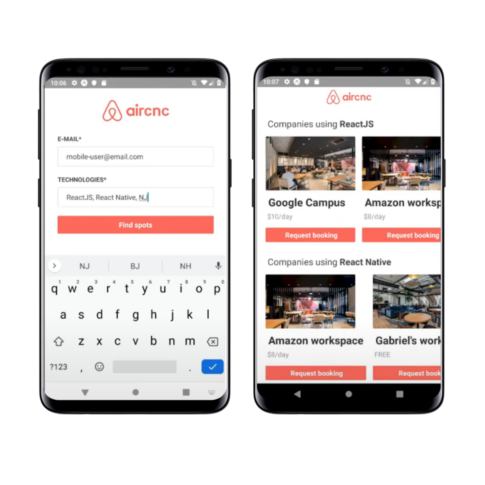

<h1 align="center">
  AirCnc
</h1>

Fullstack project to connect developers with workspace spots.

Application based on AirBnB plataform. It was developed by RocketSeat team during the "Omnsistack week 9.0". It's composed by:
- Mobile plataform to request a time schedule to a workspace;
- Web plataform to receive requests in real time and accepting or declining the ask.

You can see the app working on this link: https://www.youtube.com/watch?v=2WvdRLtoMDk
 

### Programming stack

Web front-end :computer:
- **ReactJS** - Socket.io, Axios.

Mobile :iphone:
- **React-native** - Expo, Socket.io, Axios.

Backend :floppy_disk:
- **Node.js** - Express, Socket.io, MongoDB, Mongoose, Multer, Dotenv.

 

## :pray: Acknowledgments
* Rocketseat team

## :thinking: Any question?
**Contact me on my social medias:** 
[LinkedIn](https://www.linkedin.com/in/gabriel-barth-silv%C3%A9rio-6081ba153/)  
[Instagram](https://instragram.com/gb1.dev)  
[YouTube](https://www.youtube.com/channel/UCmA_19d5L3WTFdDfwQ6Uenw)  
[Discord](https://www.wikihow.com/Add-Friends-on-Discord) (**gabrielbarth1#0492**) 
Or send me an email :incoming_envelope:: gabrielbarth.dev@gmail.com.
 
 

  Made with ♥ by <a href="https://gabrielbarth.com/">Gabriel Barth</a>

