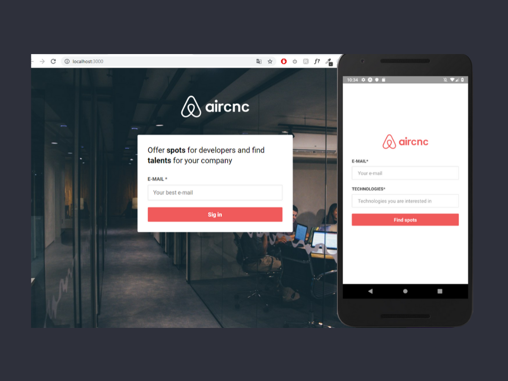
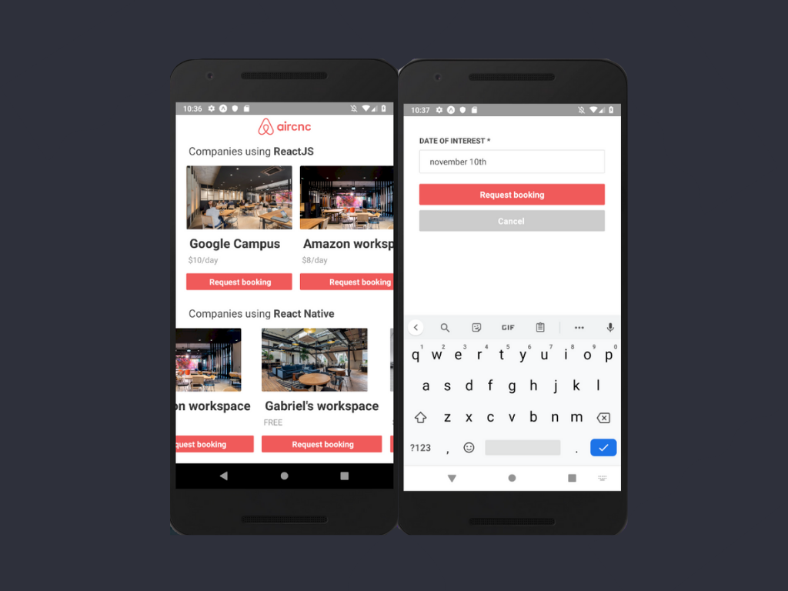
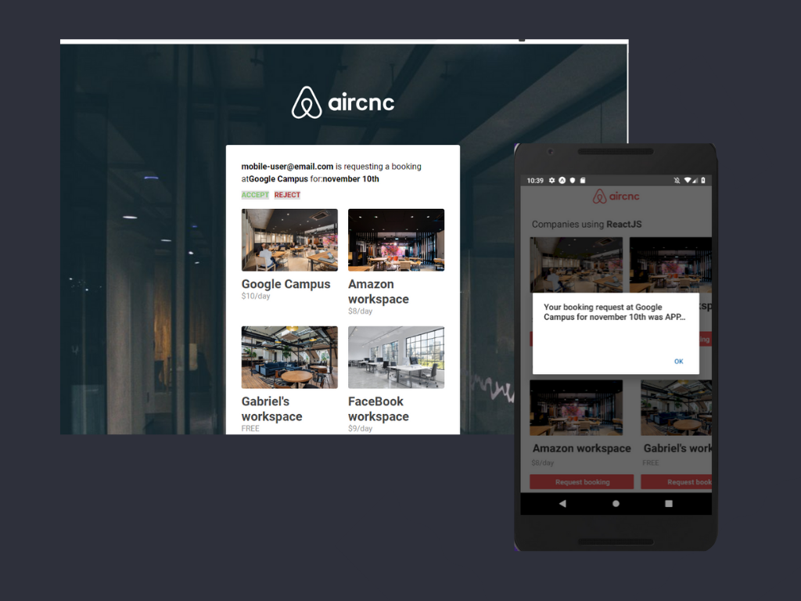

# airCnc


```diff
# português-br
```

Sistema baseado na plataforma AirBnB desenvolvido durante a semana Omnistack 9.0 da RocketSeat. Composição:
- Plataforma mobile para solicitar agendamento de spots em wokspaces da cidade;
- Plataforma web para receber requests, em tempo real, para aceitar ou recusar o agendamento.

Você pode ver o funcionamento do app no link: https://www.youtube.com/watch?v=2WvdRLtoMDk

<br>


```diff
# english
```

Application based on AirBnB plataform. It was developed by RocketSeat team during the "Omnsistack week 9.0". It's composed by:
- Mobile plataform to request a time schedule to a workspace;
- Web plataform to receive requests in real time and accepting or declining the ask.

You can see the app working on this link: https://www.youtube.com/watch?v=2WvdRLtoMDk
<br>

> Stack

Frontend (Web)
<br>
- ReactJS; Socket.io; Axios.

Mobile
<br>
- React-native; Expo; Socket.io; Axios.

Backend
<br>
- Node.js; Express; Socket.io; MongoDB; Mongoose; Multer; Dotenv

<br>




